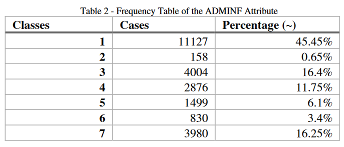
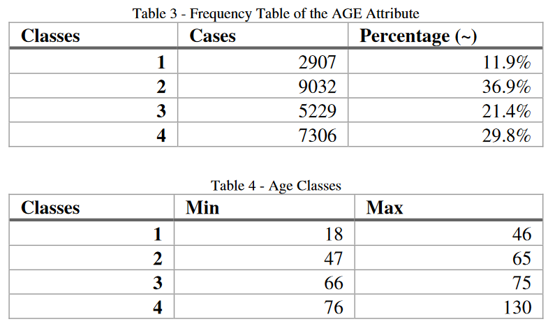
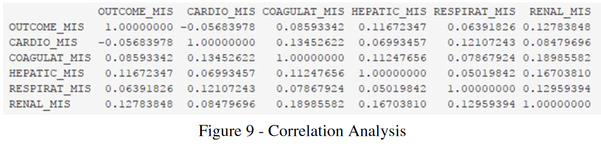
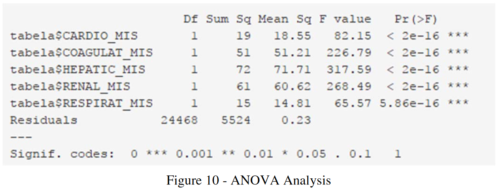
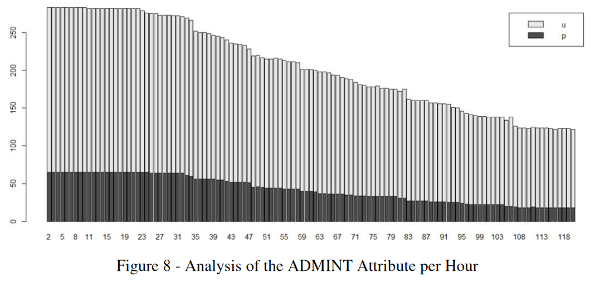

# Análise da Importância da Estatística para Mineração de Dados e Ciência de Dados

## Gustavo Campos, Juan Fricke

### Universidade Regional do Noroeste do Estado do Rio Grande do Sul (Unijuí)

---

# Introdução

A análise estatística desempenha um papel fundamental em projetos de Mineração de Dados (Data Mining - DM), oferecendo métodos robustos para a compreensão, preparação e avaliação de dados.

---

# Contexto do Estudo

- Este estudo explora como o artigo "Importance of Statistics for Data Mining and Data Science" enfatiza a importância da estatística em projetos de DM.
- Utiliza como base a metodologia Cross Industry Standard Process for Data Mining (CRISP-DM).
- Analisa a aplicação das técnicas de estatística descritiva em um caso de uso.

---

# Sobre o Artigo

## Estrutura do Artigo:

1. **Introdução**: Contexto do trabalho e temas tratados.
2. **Referencial teórico**: Ciência dos Dados, Estatística, Métodos Estatísticos e Mineração de Dados.
3. **Processo CRISP-DM**: Estrutura para execução de projetos de DM.
4. **Importância da estatística**: Fundamentação da relevância dos métodos analíticos.
5. **Ferramentas analíticas**: Ferramentas para análises estatísticas.
6. **Caso de estudo**: Aplicação prática em dados de UTIs.
7. **Conclusão**: Síntese dos resultados e temas abordados.

---

# Referencial Teórico

### Ciência dos Dados e Estatística

- **Ciência dos Dados**: Disciplina que usa métodos, processos, algoritmos e sistemas para extrair conhecimento e insights dos dados.
- **Estatística**: Ciência dos dados que envolve coletar, classificar, estruturar, organizar, analisar e interpretar informações numéricas.

### Métodos Estatísticos

- Estatísticas descritivas e inferenciais.
- Objetivo: Descrever conjuntos de dados e descobrir padrões.

---

# Mineração de Dados (Data Mining)

- **Definição**: Processo de descobrir padrões em grandes conjuntos de dados.
- **Objetivo**: Transformar dados brutos em informações úteis.
- **Métodos**: Algoritmos de aprendizado de máquina, inteligência artificial e estatística.

---

# Processo CRISP-DM

- **Cross Industry Standard Process for Data Mining**: Metodologia padrão para execução de projetos de DM.
- **Fases do CRISP-DM**:
  1. Entendimento do negócio.
  2. Entendimento dos dados.
  3. Preparação dos dados.
  4. Modelagem.
  5. Avaliação.
  6. Implantação.

---

# Importância da Estatística

- **Fundamentação**: A estatística fornece métodos robustos para a análise e interpretação de dados.
- **Aplicação**: Usada para validar resultados de modelos de DM e garantir a precisão das previsões.

---

# Ferramentas Analíticas

- **Exemplo de Ferramenta**: Linguagem R.
- **Capacidades**: Análises estatísticas de alta qualidade e operações de DM.

---

# Caso de Estudo

- **Contexto**: Dados das Unidades de Terapia Intensiva (UTIs) do Hospital Santo Antônio de Porto.
- **Dados**: Informações sobre sinais vitais de pacientes coletados ao longo de 120 horas.

---

# Métodos Usados no Caso de Estudo

- **Algoritmos de Seleção de Características**: Diversos algoritmos foram empregados para selecionar variáveis importantes.
- **Modelos Preditivos**: Criados 84 modelos para prever a sobrevivência dos pacientes.
- **Função de Aptidão**: Medidas de especificidade, sensibilidade e precisão superiores a 80%.

---

# Modelo C5.0

- **Desempenho**: Modelo C5.0 destacou-se, alcançando 89.5% de precisão.
- **Atributos Relevantes**: ADMINF, ADMINT e AGE tiveram impacto significativo.

---

# Análise Estatística com R

- **Ferramenta**: Linguagem R usada para análise detalhada.
- **Impacto dos Atributos**: ADMINF, ADMINT e AGE tiveram impacto de 100% em todos os cenários.

---

# Tabelas de Frequências

- **Análise de Frequências**: Tabelas usadas para analisar variáveis destacadas.

*Tabela de frequência do atributo ADMINF.*

---

# Frequência por Faixa Etária

*Tabela de frequência e de classificação do atributo AGE.*

---

# Análise de Correlação

- **Correlação**: Mede a força e direção da associação linear entre variáveis.
- **Análise**: Identificação de atributos dependentes.

*Tabela de correlação entre atributos analisados.*

---

# Análise de Variância

- **Objetivo**: Verificar a significância dos atributos.
- **Resultado**: Todos os atributos são significativos.

*Análise de variância das variáveis utilizadas na análise de correlação.*

---

# Análise Gráfica

- **Distribuição**: Casos urgentes são mais frequentes.
- **Tempo de Permanência**: Pacientes de casos programados deixam os cuidados intensivos mais cedo.

*Análise gráfica do atributo ADMINT por hora.*

---

# Conclusão do Caso de Estudo

- **Impacto dos Atributos**: ADMINF, ADMINT e AGE são significativos.
- **Validação**: Uso da estatística e R para validação dos resultados.
- **Benefício**: Melhoria na tomada de decisões clínicas.

---

# Considerações Finais

- **Importância da Estatística**: Essencial em projetos de Mineração de Dados.
- **Metodologias Estruturadas**: CRISP-DM como base sólida.
- **Ferramentas Analíticas**: Necessidade de ferramentas robustas como R.

---

# Referências

- Ribeiro, 2017.
- Portela, 2014.
- CRISP-DM.

---

# Agradecimentos

Obrigado!

## Gustavo Campos, Juan Fricke

Universidade Regional do Noroeste do Estado do Rio Grande do Sul (Unijuí)
